# Django loyihani ahostga yuklash

### Assalomu alekum. Ushbu maqolada django loyihani [**ahost**](https://ahost.uz)ga static va media fayllar bilan birga deploy qilishni o'rganasiz

> Muallif: [Abdusamad](https://t.me/malikovdev)

> Savollar uchun guruh: [Djangouzb](https://t.me/djangouzb)

Ushubu maqolada [ushbu sahifadagi](https://github.com/sevbo2003/ahost-demo) loyihani yuklaymiz.

Bu maqolani bo'limlarga bo'lmimiz. Shuchaki ketma ketlikda bajaramiz xolos. Qani unda boshladik

## Birinchi bosqich

1. Ushbu sahifaga o'tib o'zizga kerakli hostingni tanlang va ketma-ketlikda aytganlarini qilib to'lov qilsayiz sizni cPanelga olib o'tadi. Mana ko'rinishi

   > Shu paytda sizdan domein ham so'raydi. Yo o'zizni eski domeiniz ni o'tkazasz yokida yangi sotib olasiz

   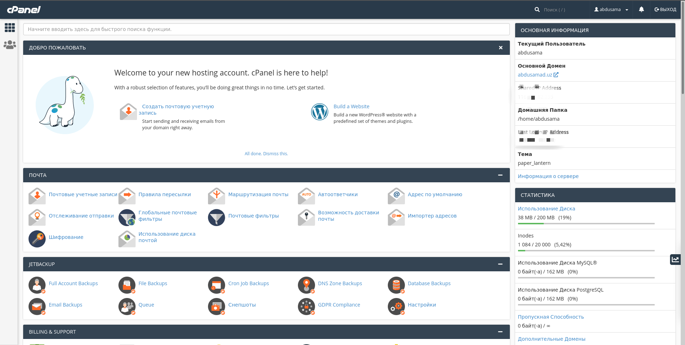

2. Men bilan bir xil ketish uchun cPanel tilini rus tiliga o'tkazib oling. Endi `Программное обеспечение` bo'limidan `Python` ni tanlang 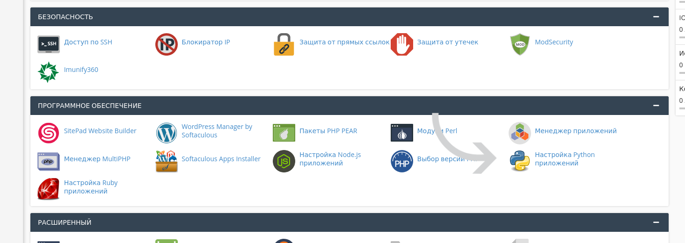
3. Keyin quyidagi ko'rinishda oyna ochiladi. Va bu yerdan ` Создать приложение` tugmasi ustiga bosasiz. 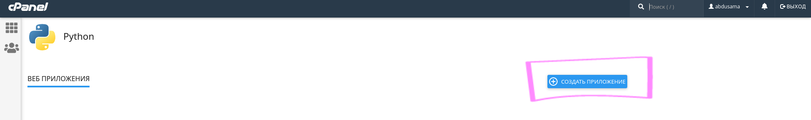
4. Mana shunaqa oyna ochiladi va pastdagi ketma-ketliklarni bajarasiz 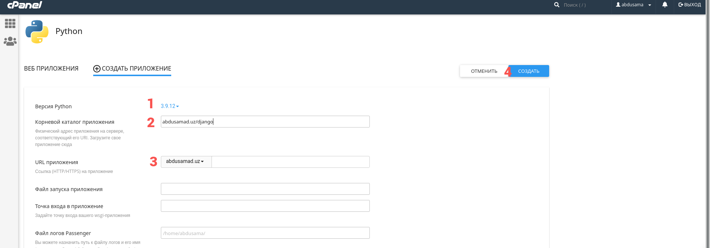
   - **1-** Python versiyasini tanlang. Eng so'ngisi hozircha 3.9.12 shuni tanlang
   - **2-** _корневой каталог_ ni kiritasz. Shunchaki quyidagi ko'rinishda yozing: `domeiniz/django` Rasmga ham qarang
   - **3-** Bu yerda domeinizni tanlisz ushbu loyiha uchun
   - **4-** ** Создать ** tugmasini bosing
5. Bundan keyin quyidagicha oyna ochiladi va belgilagan joyiman ko'chirib olasz(kopirovat) 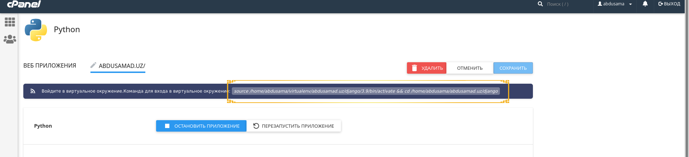
6. Ana endi yana bosh sahifaga qaytib **Расширенный** bo'limidan **Terminal** ni tanlisiz va 5-bosqichdagi ko'chirib olgan text ni shu terminalga tashab enter ni bosasz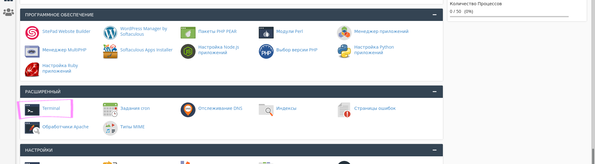 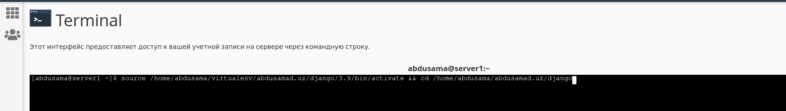
7. Ushbu buyruq orqali `pip` ni yangilab olasiz
   ```python
   pip install --upgrade pip
   ```

## Django qismi

1. Mana endi django proyektimizni github orqali yulaymiz. Shunchaki pastdagi ketma ketliklarni bajaring faqat mening github repositoryim o'rniga o'ziznikini kiriting
   ```python
   git init
   git remote add origin https://github.com/sevbo2003/ahost-demo.git # o'zizni githubizni kiriting
   git pull origin master
   pip install -r requirements.txt
   ```
2. Anda endi projectizmizni ahost ga tanitishimiz kerak. Buning uchun bosh sahifadagi **менеджере файлов** bo'limiga kiramiz. Keyin chiqadigan oynadan domeiniz yozilgan papkaga ustiga bosish orqali kirasz va undan keyin django degan papka ochiladi unga ham kirasz va pastdagiday sahifa chiqadi. 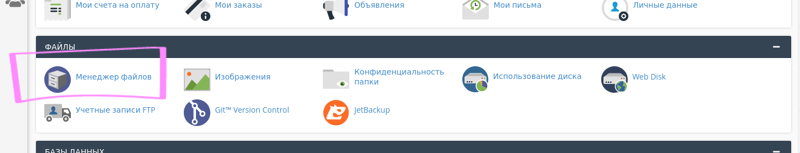 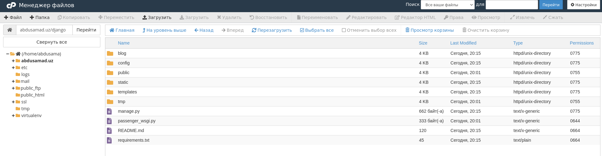
3. 2-bosqichda ochilgan sahifadan `passenger_wsgi.py` degan faylni ochish kerak bo'ladi. Buning uchun `passenger_wsgi.py` ustiga bosasiz `Редактировать` degan tugma bor o'shani bossayiz yana bitta oynacha ochiladi bundan `edit` tugmasini bosasiz: Batafsil rasmga qarang. Ketma ketlik ko'rsatilgan 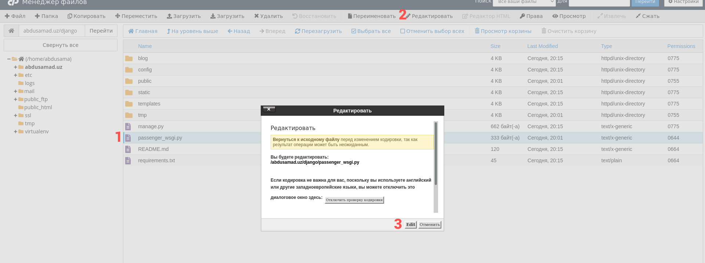
4. 3-bosqichdagi edit tugmasini bosganizdan keyin yangi sahifa ochiladi ichida kodlari bilan. Shu kodlarni o'chirib o'rniga quyidagi kodni kiritasz
   > config o'rniga `wsgi.py` fayli turgan papkani kiritasz. Masalan manda `config` papkasi ichida joylashgan
   ```python
   from config.wsgi import application
   ```
   Bundan keyin `Сохранить изменения` tugmasini bosib chiqib ketasiz.
   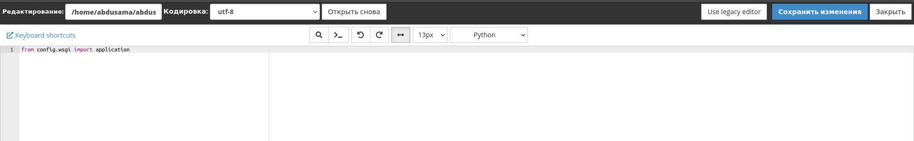

## Django sozlamalari

> ### Ushbu qismda static va media fayllar ishlashi uchun loyiyamizni sozlimiz. Buning uchun o'zimizni komputerdagi projectimizga kiramiz va o'zgartirishlar kiritib github ga push qilamiz va ahostdagi cPanel terminalidan pull qilib olamiz.

1. Debug ni False ga tenglashtiramiz
   ```python
   DEBUG = False
   ```
2. `ALLOWED_HOSTS` ga ahostdagi domeinimizni 2 xil ko'rinishda qo'shamiz. Ya'ni birinchi o'zini keyin www orqali. Masalan:
   ```python
   ALLOWED_HOSTS = ["abdusamad.uz", "www.abdusamad.uz"]
   ```
3. Database ga teginmimiz. Lekin sqlite3 o'rniga Postgres yoki boshqa SQL database ishlatishni maslahat beraman
   > ⚠️ Postgres yoki boshqa database ishlatish yaxshi.
4. Mana endi static va media larni to'g'irlimiz. Buning uchun **cPanel** dagi terminal ga kiramiz va `pwd` buyrug'ini kiritamiz va chiqqan natijani ko'chirib(kopirovat qilib) olamiz. 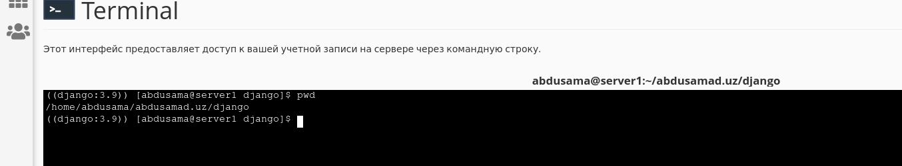
5. Keyin django loyihamizga kirib static va media file larni quyidagi ko'rinishga keltiramiz. Static filelar haqida batafsil bilish uchun [quyidagi maqolani o'qing](https://github.com/sevbo2003/common-python-problems/blob/master/django-static-filelar.md). Endi 4-bosqichda ko'chirgan textni(file path) ni menikini o'rniga static faylizni turgan papkani qo'shish orqali yozasz. Namuna:
   ```python
   STATICFILES_DIRS = '/home/abdusama/abdusamad.uz/django/static_files',)
   STATIC_ROOT = '/home/abdusama/abdusamad.uz/django/static'
   MEDIA_URL = 'media/'
   MEDIA_ROOT = '/home/abdusama/abdusamad.uz/django/media'
   ```
6. Asosiy `urls.py` ni ichiga static url larni tanitishimiz kerak. Buning uchun `urlpatterns` ga `STATIC_URL` va `STATICFILES_DIRS` ni va media ni ham qo'shib qo'yamiz. Namunaviy kod:

   ```python
   from django.contrib import admin
   from django.urls import path
   from django.conf import settings # setting.py ni import qildik
   from django.conf.urls.static import static


   urlpatterns = [
       path('admin/', admin.site.urls),
   ]

   urlpatterns += static(settings.STATIC_URL, document_root=settings.STATIC_ROOT)
   urlpatterns += static(settings.MEDIA_URL, document_root=settings.MEDIA_ROOT)
   ```

7. Whitenoise qo'shish. Endi static fayllarni saqlash uchun whitenoise o'rnatishimiz kerak. Ushbu buyruq orqali o'rnatamiz:
    ```python
    pip install whitenoise
    ```
    Keyin `INSTALLED_APPS` ga `'whitenoise.runserver_nostatic',` ni qo'shib qo'yamiz. Undan keyin esa MIDDLEWARE ichiga ham whitenoise ni qo'shish kerak:
    ```python
    MIDDLEWARE = [
        'django.middleware.security.SecurityMiddleware',
        
        # whitenoise ni shu yerga qo'shing
        'whitenoise.middleware.WhiteNoiseMiddleware',
        # ...
    ]
    ```
    > Bu yerda sal e'tiborli bo'ling. Ya'ni whitenoise ni Djangoning o'zida mavjud bo'lgan `SecurityMiddleware` tagiga qo'shing
    Keyingi ish esa STATIC_URL tagidan ushbu whitenoise STORAGE ni qo'shib qo'ying:
    ```python
    STATICFILES_STORAGE = 'whitenoise.storage.CompressedManifestStaticFilesStorage'
    ```

8. Mana barchasini sozlab oldik. Endi github ga push qilamiz:
   ```python
   git add .
   git commit -m "Deploy uchun tayyorladik"
   git push origin master
   ```
9. Ana endi qaytib cPanel da turgan loyihamizga qilgan o'zgartirishlarimizni kiritamiz. Bunign uchun quyidagi buyruqni kiriting:
   ```python
   git pull origin master
   ```
   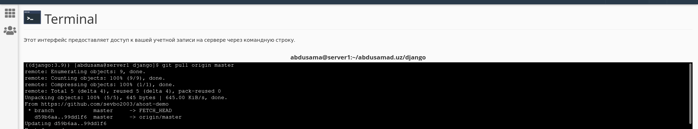
10. Endi static filelarimiz ishlashi uchun quyidagi buyruqni teramiz.
    ```python
    python manage.py collectstatic
    ```
    Agar to'g'ri qilgan bo'lsayiz fayllariz ko'chirilganligi haqida xabar olasz. 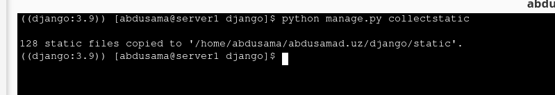
11. Endi django loyihayiz uchun har doim qiladigan ishlarni qilamiz. Ya'ni makemigrations lar va admin user yaratish. Masalan:
    ```python
    python manage.py makemigrations
    python manage.py migrate
    python manage.py createsuperuser
    ```
12.

## So'ngi ish

### Mana endi so'ngi qismga ham yetib keldik.

1. Endi asosiy cPanel sahifasidagi Python bo'limiga boshqatdan kiramiz 
2. Ochilgan oynadan restart tugmasini bosamiz 

# TUGADI. 
## Star bosib [kanalga](https://t.me/malikovdev) a'zo bo'lish esdan chiqmasin

## Saytdan namunalar:
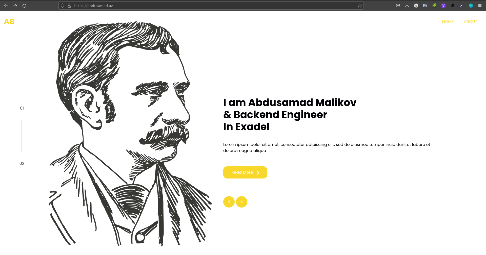
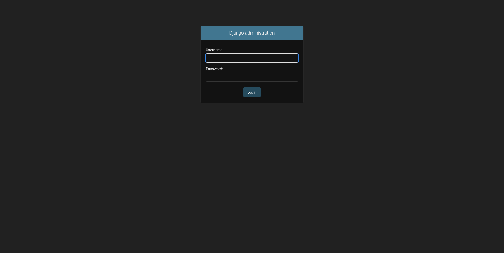